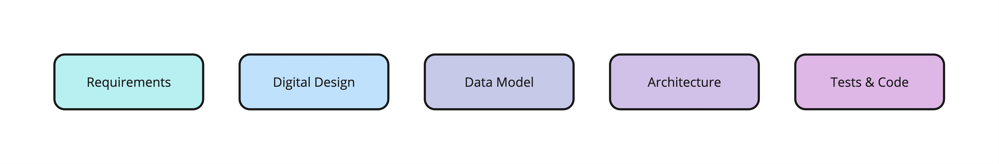
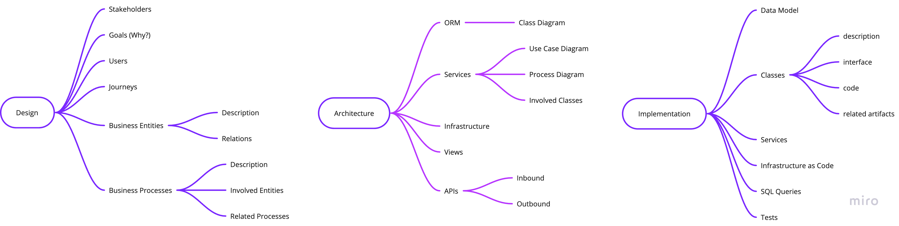

## Supporting Software Development with LLMs

Software is pivotal for almost all services that we use in our daily lives from using the dishwasher to driving our car. Paradoxically, although software helps us to do things fast and efficient, building software often is a cumbersome process with many tedious manual and mostly unautomated steps.

While there are various well established process frameworks for building software a lot of effort and costs stem from manual labour, e.g. during the design phase like defining requirements, writing user journeys and epics or when designs are being translated into software entities like classes, functions and attributes or when writing tests and code. Additionally, for software services providers creating an offer for requests (i.e. RfPs) is a time-consuming task because it takes a lot of time to fully understand the requirements, before being able to estimate efforts and costs.

In the mean time we have seen a lot of evidence that AI is capable of generating high-quality text, images, voice and more that is often undistinguishable from human generated content.
However, when naively asking ChatGPT to generate an app to manage your personal finances or create a website for an online shop with all the bells and whistles there is only a little chance that something overly helpful will be outputted. While initially you might get some promising results it is very likely that at some point ChatGPT will lose touch of relevant context if the conversation becomes longer or that partial results will be inconsistent which requires the user to be technically skilled to spot mistakes on its own and put things together correctly.

Even if GPTs and the likes will get much larger context windows in the in the near future, i.e. are able to handle more information per request, it is unlikely that a model will be able to generate high-quality artifacts along the software development lifecycle from a vague and highly underspecified system description. As LLMs are predicting tokens based on previous tokens it is much more likely that at some point the model will deviate from what we need, and due to its autoregressive nature this output will be used later on which amplifies the initial error at each step which might bring undesirable final results. What can be done to prevent such a behavior?

One effective way is to keep the human in the loop, to steer the process, readjusting the model after each step and keeping it from going wild. In such a scenario, we could use the model for all the time-consuming and laborious things (luckily things the model is typically best at). However, the model is only as good as we enable it by a) defining a given task as precise as possible for example through the right prompt and b) providing only relevant information for the task at hand. Finding the right prompt to encode a task is the general goal of prompt engineering and  by now various frameworks exist to tackle different problem classes (CoT, ToT, GoT,...). Providing relevant information for a given task can be achieved by separating the data from the LLM and searching relevant data with semantic search to feed only relevant parts to prevent distracting the model (also know as retrieval augmented generation (RAG)). 

When the model has done its job of generating an artifact (story, epic, test,...) the human can take back control by adjusting the model output thereby preventing the model to build upon a flaw that it made in an earlier step. In return, the user can take a more holistic perspective by guiding the process as the cognitive load will not be consumed by creating the write-intensive details.

